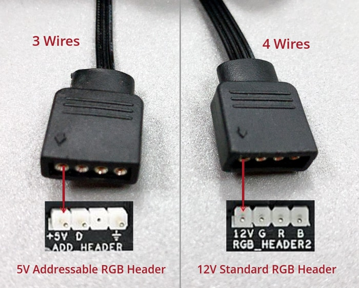

## Why
I created this script to control a set of ARGB LED via an arduino that accepts commands from a button and from the PC.

## External Resources
\# todo - populate this section

## Scheme

## TO-DO

CHANGE COLOR BASED ON CPU TEMP
REMEBER LAST SELECTION
