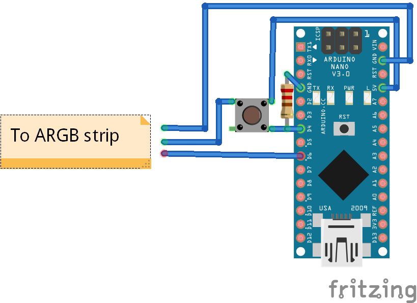

## Why
I created this script to control a set of ARGB LED via an arduino that accepts commands from a button and from the PC.

## External Resources
I took inspiration for the part that reads the cpu info from [here](https://github.com/BennyCarbajal/PyTherm)

I created the icon by editing an icon taken [here](https://icons8.com/)

## Scheme

## TO-DO

CHANGE COLOR BASED ON CPU TEMP
